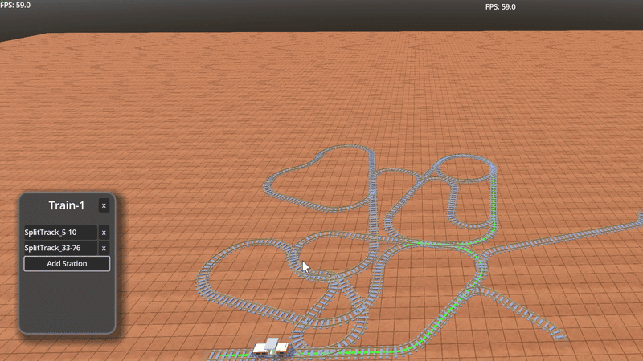

# DEMO

## Placing tracks

 

## Placing realllly looong tracks 
while maintaing 60 fps. Wrote the code in C++ to generate the polygons for the track so it's efficient(as well as other speedups)
 

## Trains can "turn around" 
when navigating between two stops
 

## Trains can navigate between multiple stops 
in a path that takes the least amount of track between all stops:
 

# How to build and run

#Run this to install GUT and install Line3d(
	https://github.com/Kevin-Jonaitis/cozy-cube-godot-addons
)
git submodule update --init --recursive

# or to clone from scratch:
git clone --recursive https://github.com/Kevin-Jonaitis/JIT-Just-In-Train

# To see the Path3d functionality:
https://github.com/godotengine/godot-proposals/issues/6151

 Build the CPP with the command(must have C++ build toolchain installed(easiest is visual studios), scons installed (pip install scons) and of course pythin)
python -m SCons platform=windows 
 I find that running things in VSCode just "works"(intellisense works properly), trying to setup in visual studio doesn't work out of the box
